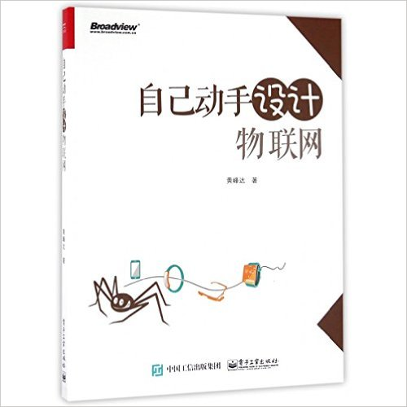

《[一步步搭建物联网系统](http://phodal.github.io/designiot/)》
===

《自己动手设计物联网》现已出版：

立即购买：[亚马逊](https://www.amazon.cn/dp/B01IBZWTWW/ref=wl_it_dp_o_pC_nS_ttl?_encoding=UTF8&colid=BDXF90QZX6WX&coliid=I19EB97K0GNLW8)、[京东](http://search.jd.com/Search?keyword=%E8%87%AA%E5%B7%B1%E5%8A%A8%E6%89%8B%E8%AE%BE%E8%AE%A1%E7%89%A9%E8%81%94%E7%BD%91&enc=utf-8&wq=%E8%87%AA%E5%B7%B1%E5%8A%A8%E6%89%8B%E8%AE%BE%E8%AE%A1%E7%89%A9%E8%81%94%E7%BD%91&pvid=k24y6hri.l4xi28)、[当当](http://product.dangdang.com/24000878.html)

**在线查看**:[一步步搭建物联网系统](http://ebook.designiot.cn/)

Android App版:

##作者名单 

Github | Name
|--------| ---------|
[phodal](https://github.com/phodal) |[Phodal Huang](http://www.phodal.com)
[Lboyve](https://github.com/Lboyve) | Xiaobing WANG

## License

© 2014~2016 [Phodal Huang](http://www.phodal.com). 

本作品采用[知识共享署名-非商业性使用 4.0 国际许可协议](http://creativecommons.org/licenses/by-nc/4.0/)进行许可。

[待我代码编成，娶你为妻可好](http://www.xuntayizhan.com/blog/ji-ke-ai-qing-zhi-er-shi-dai-wo-dai-ma-bian-cheng-qu-ni-wei-qi-ke-hao-wan/)

